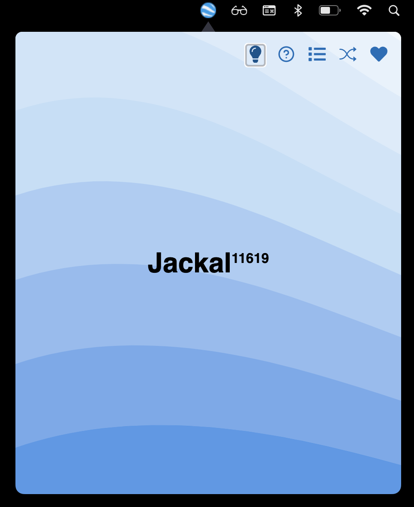

# Credit

All credit and copyrights goes to OpenAI who developed [ChatGPT for Mac](https://github.com/vincelwt).

## Jackal for desktop

This is a simple app that makes Jackal live in your menubar.

You can use Cmd+Shift+G (Mac) or Ctrl+Shift+G (Win) to quickly open it from anywhere.

Download:

- [Mac Arm64 .dmg](https://github.com/tpkahlon/jackal-mac/releases/download/0.0.1/Jackal-0.0.1-arm64.dmg)
- [Mac Intel .dmg](https://github.com/tpkahlon/jackal-mac/releases/download/0.0.1/Jackal-0.0.1-x64.dmg)

  

## Author

You can find me on GitHub [@tpkahlon](https://github.com/tpkahlon).
